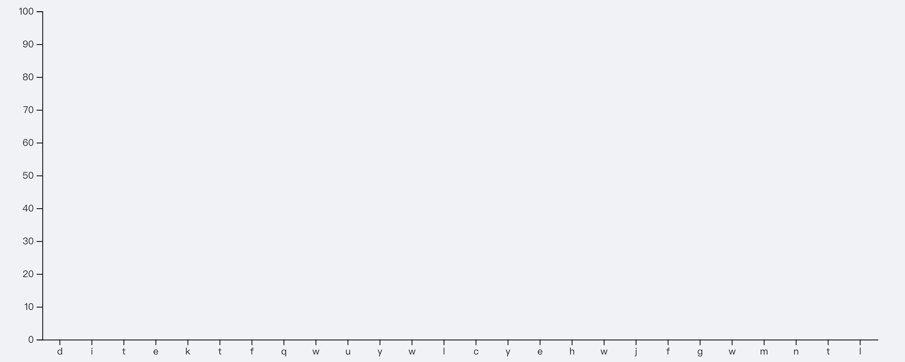

### 比例尺

​ 比例尺主要就是用于将抽象的数据维度映射到可视化图表当中

- 对于连续的数据可以使用可以使用 scaleLinear(线性比例尺)

  ```javascript
  const scale = d3.scaleLinear().domain([0, 100]);
  ```

- 时间类的数据可以使用 scaleTime(时间比例尺)

-

### 坐标轴

坐标轴，是可视化图表中经常出现的一种图形，由一些列线段和刻度组成。坐标轴在 SVG 中是没有现成的图形元素的，需要用其他的元素组合构成。D3 提供了坐标轴的组件，如此在 SVG 画布中绘制坐标轴变得像添加一个普通元素一样简单。



- d3.axisLeft(scale) | d3.axisRight(scale)

  - 为给定的 scale 创建一个位于左侧|右侧的坐标轴。一般用于创建 y 轴

    ```javascript
    // 创建如上图所见的y轴
    const yScale = scaleLinear() // 设置y轴比例尺,scaleLinear常用于数值比例尺
      .domain([0, 100]) // 比例尺范围区间
      .nice()
      .padding(0.1);

    chart.append('g').call((g) => {
      g.attr('transform', `translate(10, 0)`) // 设置坐标轴偏移位置
        .call(axisLeft(yScale).ticks(10, null));
    });
    ```

- d3.axisBottom(scale) ｜ d3.axisTop(scale)

  - 为给定的 scale 创建一个位于底部｜右侧的坐标轴。一般用于创建 x 轴

    ```javascript
    // 创建如上图所见的x轴
    const xScale = scaleBand() // 离散比例尺
    	.domain(['a', 'b', 'c', ...., 'z'])
    	.range(10, 500); // 设置x轴范围区间
    chart.append('g').call(g => {
      g.tickFormat((i) => xScale(i))
      	.tickSizeOuter(0);
    })
    ```
